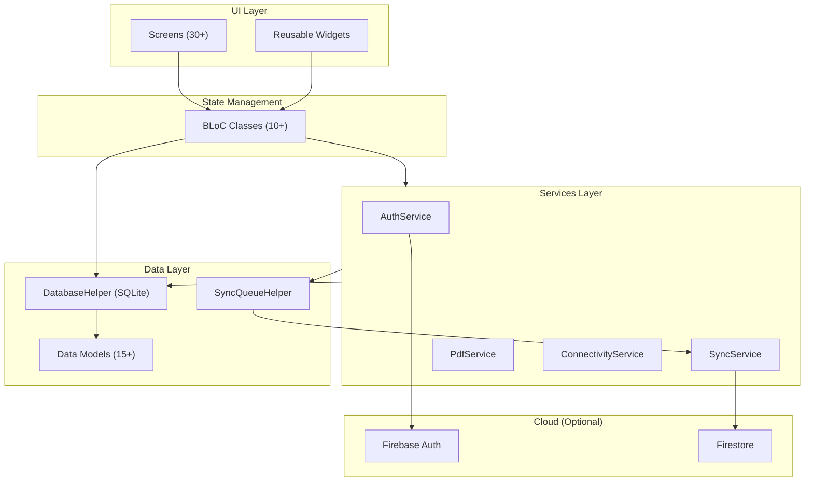

# Business Manager Pro — Implementation Plan

A complete Flutter Desktop (Windows) ERP/CRM/Invoicing/Inventory application with offline-first SQLite storage and Firebase cloud sync.

**Workspace:** `d:\LogiTech`  
**Runtime:** Flutter 3.38.4 (Windows desktop)

---

## User Review Required

> [!IMPORTANT]
> **Firebase Configuration:** This plan assumes you will provide a Firebase project. I will scaffold `firebase_options.dart` with placeholder values. You will need to:
> 1. Create a Firebase project at [console.firebase.google.com](https://console.firebase.google.com)
> 2. Enable **Email/Password** authentication
> 3. Create a **Firestore** database
> 4. Run `flutterfire configure` to generate the real `firebase_options.dart`
>
> The app will work **fully offline** without Firebase configured — all data lives in SQLite.

> [!WARNING]
> **Project size:** This is an extremely large application (~60+ files, ~15,000+ lines). I will implement it in phases. Each phase produces a buildable, runnable application so you can test incrementally.

> [!IMPORTANT]
> **SQLite on Windows Desktop:** Flutter's `sqflite` package does not natively support Windows desktop. I will use `sqflite_common_ffi` which uses the FFI-based SQLite implementation for desktop platforms. This is the standard approach for Flutter desktop apps.

## Open Questions

1. **Currency:** Should the app default to **DZD (Algerian Dinar)**, **EUR**, or another currency? I'll default to **DZD** based on the French/Arabic context.
2. **Tax System:** The TVA rates — should I default to Algerian rates (19%, 9%, 0%) or French rates (20%, 10%, 5.5%, 2.1%)?
3. **Print Layout:** A4 paper size for all PDFs?
4. **Multi-user:** Should multiple users be able to share the same company data (team mode), or is this single-user per company?

---

## Proposed Changes

The project will be built in **10 phases**, each producing a working application.

---

### Phase 1: Project Scaffold & Core Architecture

Set up the Flutter project, dependencies, database, and app shell.

#### [NEW] `pubspec.yaml`
- Flutter desktop project with all required dependencies
- Using `sqflite_common_ffi` for Windows SQLite support
- All packages from the spec plus `fl_chart` for dashboard charts

#### [NEW] `lib/main.dart`
- App entry point with MaterialApp, theme configuration, routing
- SQLite initialization via FFI
- Firebase initialization (with graceful offline fallback)

#### [NEW] `lib/firebase_options.dart`
- Placeholder Firebase config (user replaces with `flutterfire configure`)

#### [NEW] `lib/utils/constants.dart`
- Color palette (primary blue `#1a56db`), text styles, spacing constants
- App-wide enums (DocumentStatus, PaymentStatus, MovementType, etc.)

#### [NEW] `lib/utils/helpers.dart`
- Currency formatting (DZD), date formatting, number helpers
- Document number generators (e.g., `FAC-2026-00001`)

---

### Phase 2: Database Layer

Complete SQLite database with all tables and CRUD operations.

#### [NEW] `lib/database/database_helper.dart`

**Core Tables:**
| Table | Key Fields |
|-------|-----------|
| `users` | id, firebase_uid, email, name, phone, role, created_at |
| `company_settings` | id, name, logo_path, address, phone, email, tax_id, rc_number, nis, nif, ai, currency, default_tva_rate |
| `customers` | id, code, name, email, phone, address, city, tax_id, rc, balance, credit_limit, notes |
| `suppliers` | id, code, name, email, phone, address, city, tax_id, rc, balance, notes |
| `products` | id, code, name, description, category, unit, purchase_price, selling_price, tva_rate, stock_qty, min_stock_qty, barcode, is_active |
| `warehouses` | id, name, address, is_default |
| `product_warehouse_stock` | product_id, warehouse_id, quantity |

**Sales Tables:**
| Table | Key Fields |
|-------|-----------|
| `quotes` | id, number, customer_id, date, validity_date, status (draft/sent/accepted/rejected/converted), total_ht, total_tva, total_ttc, notes |
| `quote_items` | id, quote_id, product_id, description, quantity, unit_price, tva_rate, discount_percent, total_ht |
| `customer_orders` | id, number, customer_id, quote_id, date, status, delivery_date, total_ht, total_tva, total_ttc |
| `customer_order_items` | id, order_id, product_id, description, quantity, unit_price, tva_rate, total_ht |
| `delivery_notes` | id, number, customer_id, order_id, date, status, warehouse_id, notes |
| `delivery_note_items` | id, delivery_note_id, product_id, quantity, unit_price |
| `invoices` | id, number, customer_id, order_id, delivery_note_id, date, due_date, status (draft/sent/partial/paid/overdue/cancelled), total_ht, total_tva, total_ttc, amount_paid, stamp_tax, notes |
| `invoice_items` | id, invoice_id, product_id, description, quantity, unit_price, tva_rate, discount_percent, total_ht |
| `credit_notes` | id, number, invoice_id, customer_id, date, reason, total_ht, total_tva, total_ttc |
| `credit_note_items` | id, credit_note_id, product_id, quantity, unit_price, tva_rate, total_ht |
| `exit_vouchers` | id, number, customer_id, date, warehouse_id, status, notes |
| `exit_voucher_items` | id, voucher_id, product_id, quantity |
| `return_vouchers` | id, number, customer_id, invoice_id, date, reason, status |
| `return_voucher_items` | id, voucher_id, product_id, quantity, reason |

**Purchase Tables:**
| Table | Key Fields |
|-------|-----------|
| `supplier_orders` | id, number, supplier_id, date, status, expected_date, total_ht, total_tva, total_ttc |
| `supplier_order_items` | id, order_id, product_id, quantity, unit_price, tva_rate |
| `receiving_vouchers` | id, number, supplier_id, order_id, date, warehouse_id, status |
| `receiving_voucher_items` | id, voucher_id, product_id, quantity_expected, quantity_received |
| `purchase_invoices` | id, number, supplier_id, order_id, date, due_date, status, total_ht, total_tva, total_ttc, amount_paid |
| `purchase_invoice_items` | id, invoice_id, product_id, quantity, unit_price, tva_rate, total_ht |
| `supplier_credit_notes` | id, number, purchase_invoice_id, supplier_id, date, total_ht, total_tva, total_ttc |
| `supplier_returns` | id, number, supplier_id, purchase_invoice_id, date, reason, status |

**Finance Tables:**
| Table | Key Fields |
|-------|-----------|
| `accounts` | id, name, type (bank/cash/other), bank_name, account_number, balance, is_default |
| `transactions` | id, account_id, type (income/expense), category, amount, date, reference, description, related_invoice_id |
| `checks_traites` | id, type (check_received/check_issued/traite_received/traite_issued), number, amount, date_issued, maturity_date, status (pending/deposited/cashed/returned/cancelled), party_name, account_id, bank_name |
| `withholding_tax` | id, type (sales/purchase), invoice_id, rate, amount, date, declaration_date |

**Stock Tables:**
| Table | Key Fields |
|-------|-----------|
| `stock_movements` | id, product_id, warehouse_id, type (entry/exit/transfer/adjustment), quantity, reference_type, reference_id, date, notes |
| `stock_entries` | id, number, warehouse_id, date, supplier_id, reason, status |
| `stock_entry_items` | id, entry_id, product_id, quantity, unit_price |
| `stock_withdrawals` | id, number, warehouse_id, date, reason, requested_by, status |
| `stock_withdrawal_items` | id, withdrawal_id, product_id, quantity |
| `stock_transfers` | id, number, from_warehouse_id, to_warehouse_id, date, status |
| `stock_transfer_items` | id, transfer_id, product_id, quantity |
| `inventory_sheets` | id, number, warehouse_id, date, status (in_progress/validated/cancelled) |
| `inventory_sheet_items` | id, sheet_id, product_id, theoretical_qty, physical_qty, difference |

**Projects & Sync:**
| Table | Key Fields |
|-------|-----------|
| `projects` | id, name, description, customer_id, start_date, end_date, budget, status (planning/active/completed/on_hold/cancelled), progress |
| `project_invoices` | project_id, invoice_id |
| `sync_queue` | id, table_name, record_id, operation (INSERT/UPDATE/DELETE), data_json, created_at, synced_at, status (pending/synced/error), error_message |
| `activity_log` | id, action, description, entity_type, entity_id, user_id, created_at |

All tables include: `created_at`, `updated_at`, `is_deleted` (soft delete), `firebase_uid` (data isolation).

#### [NEW] `lib/database/sync_queue_helper.dart`
- Queue operations for INSERT/UPDATE/DELETE
- Mark synced, get pending items, purge old synced items

---

### Phase 3: Data Models

Dart model classes with JSON serialization, SQLite mapping, and Firestore mapping.

#### [NEW] `lib/models/customer.dart`
#### [NEW] `lib/models/supplier.dart`
#### [NEW] `lib/models/product.dart`
#### [NEW] `lib/models/invoice.dart` (+ InvoiceItem)
#### [NEW] `lib/models/quote.dart` (+ QuoteItem)
#### [NEW] `lib/models/delivery_note.dart` (+ DeliveryNoteItem)
#### [NEW] `lib/models/purchase_invoice.dart` (+ PurchaseInvoiceItem)
#### [NEW] `lib/models/stock_movement.dart`
#### [NEW] `lib/models/transaction_model.dart` (renamed to avoid Dart conflict)
#### [NEW] `lib/models/check_traite.dart`
#### [NEW] `lib/models/project.dart`
#### [NEW] `lib/models/warehouse.dart`
#### [NEW] `lib/models/account.dart`
#### [NEW] `lib/models/company_settings.dart`
#### [NEW] `lib/models/sync_queue_item.dart`
#### [NEW] `lib/models/activity_log.dart`

Each model includes:
- `fromMap()` / `toMap()` for SQLite
- `fromFirestore()` / `toFirestore()` for cloud sync
- `copyWith()` for immutable updates

---

### Phase 4: Services Layer

#### [NEW] `lib/services/auth_service.dart`
- Firebase Auth login/register/logout
- Offline mode detection (skip Firebase when unavailable)
- Current user state management

#### [NEW] `lib/services/sync_service.dart`
- Periodic sync (every 5 minutes when online)
- Push local changes → Firestore
- Pull remote changes → SQLite
- Conflict resolution via `updated_at` timestamps
- Sync status stream for UI indicator

#### [NEW] `lib/services/connectivity_service.dart`
- Monitor network connectivity
- Expose `isOnline` stream
- Periodic connectivity checks

#### [NEW] `lib/services/pdf_service.dart`
- Invoice PDF with company header, customer info, items table, TVA breakdown, totals, QR code
- Quote PDF, Delivery Note PDF, Credit Note PDF
- Shared PDF template with professional layout

---

### Phase 5: BLoC State Management

#### [NEW] `lib/blocs/auth/auth_bloc.dart`
#### [NEW] `lib/blocs/customers/customers_bloc.dart`
#### [NEW] `lib/blocs/suppliers/suppliers_bloc.dart`
#### [NEW] `lib/blocs/products/products_bloc.dart`
#### [NEW] `lib/blocs/invoices/invoices_bloc.dart`
#### [NEW] `lib/blocs/quotes/quotes_bloc.dart`
#### [NEW] `lib/blocs/stock/stock_bloc.dart`
#### [NEW] `lib/blocs/dashboard/dashboard_bloc.dart`
#### [NEW] `lib/blocs/transactions/transactions_bloc.dart`
#### [NEW] `lib/blocs/projects/projects_bloc.dart`

Each BLoC handles: Loading, CRUD operations, filtering, search, pagination.

---

### Phase 6: Core UI — Shell, Sidebar, Dashboard

#### [NEW] `lib/widgets/sidebar_menu.dart`
- Collapsible sidebar with all modules and submenus
- Icons, active state highlighting, expand/collapse animations
- Module grouping (Ventes, Achats, Paiements, Stock)

#### [NEW] `lib/widgets/app_shell.dart`
- Main layout: Sidebar + Content area
- Top bar with sync indicator, user info, search

#### [NEW] `lib/widgets/dashboard_card.dart`
- KPI card widget with icon, value, label, trend indicator

#### [NEW] `lib/widgets/sync_indicator.dart`
- Online/Offline badge
- Last sync time
- Sync progress indicator

#### [NEW] `lib/widgets/custom_app_bar.dart`
- Top app bar with breadcrumbs, search, notifications

#### [NEW] `lib/widgets/data_table_widget.dart`
- Reusable data table with sorting, filtering, pagination, search
- Row actions (edit, delete, view, print)
- Export to Excel capability

#### [NEW] `lib/screens/dashboard_screen.dart`
- 4 KPI cards (Facturé, BL, Paiements, TVA)
- Cash flow chart (using `fl_chart`)
- Upcoming checks/traites table
- Recent invoices table
- Low stock alerts
- Activity log

---

### Phase 7: Authentication Screens

#### [NEW] `lib/screens/login_screen.dart`
- Professional login form with company branding
- Email/password fields, "Se connecter" button
- Offline mode option (skip login for local-only use)

#### [NEW] `lib/screens/register_screen.dart`
- Registration form with company details
- Email, password, company name, phone

---

### Phase 8: Module Screens — Sales, Purchases, Parties, Products

#### [NEW] `lib/screens/customers_screen.dart` — Customer list + CRUD dialog
#### [NEW] `lib/screens/suppliers_screen.dart` — Supplier list + CRUD dialog
#### [NEW] `lib/screens/products_screen.dart` — Product list + CRUD dialog

#### [NEW] `lib/screens/invoices_screen.dart` — Invoice list with status filters
#### [NEW] `lib/screens/create_invoice_screen.dart` — Full invoice creation form
#### [NEW] `lib/screens/quotes_screen.dart` — Quote list + create + convert to invoice
#### [NEW] `lib/screens/delivery_notes_screen.dart` — Delivery note management
#### [NEW] `lib/screens/credit_notes_screen.dart` — Credit note management

#### [NEW] `lib/screens/purchase_invoices_screen.dart` — Purchase invoice list
#### [NEW] `lib/screens/supplier_orders_screen.dart` — Supplier order management

---

### Phase 9: Module Screens — Stock, Finance, Projects, Reports

#### [NEW] `lib/screens/stock_screen.dart` — Stock dashboard with overview
#### [NEW] `lib/screens/stock_entry_screen.dart` — Create stock entries
#### [NEW] `lib/screens/stock_withdrawal_screen.dart` — Stock withdrawals
#### [NEW] `lib/screens/stock_transfer_screen.dart` — Warehouse transfers
#### [NEW] `lib/screens/inventory_sheet_screen.dart` — Physical inventory counts
#### [NEW] `lib/screens/warehouses_screen.dart` — Warehouse management

#### [NEW] `lib/screens/transactions_screen.dart` — Income/expense tracking
#### [NEW] `lib/screens/checks_traites_screen.dart` — Check/traite management
#### [NEW] `lib/screens/withholding_tax_screen.dart` — Withholding tax tracking

#### [NEW] `lib/screens/projects_screen.dart` — Project management

#### [NEW] `lib/screens/reports_screen.dart` — Reports hub
#### [NEW] `lib/screens/sales_report_screen.dart` — Sales analytics
#### [NEW] `lib/screens/stock_report_screen.dart` — Inventory report
#### [NEW] `lib/screens/tva_report_screen.dart` — TVA declaration helper

---

### Phase 10: Settings & PDF Templates

#### [NEW] `lib/screens/settings_screen.dart`
- Company settings form (logo, name, address, tax IDs)
- TVA rates configuration
- Invoice numbering format
- Backup/Restore (export/import SQLite database)
- Sync settings (interval, auto-sync toggle)

#### [NEW] `lib/utils/pdf_template.dart`
- Professional PDF layout builder
- Company header with logo
- Document details (number, date, customer)
- Items table with columns
- TVA breakdown table
- Totals section (HT, TVA, TTC, Timbre)
- Footer with payment terms

---

## Architecture Diagram



---

## Verification Plan

### Automated Tests
```bash
flutter analyze    # Static analysis — zero errors
flutter build windows   # Successful Windows build
```

### Manual Verification
- Launch app on Windows
- Navigate all sidebar menu items
- Create a customer, product, and invoice
- Generate and preview an invoice PDF
- Verify dashboard KPI cards populate
- Test offline mode (disconnect network)
- Verify sync indicator shows correct status

---

## Estimated File Count

| Category | Files | Approx. Lines |
|----------|-------|--------------|
| Models | 16 | ~2,500 |
| Database | 2 | ~1,500 |
| Services | 4 | ~1,200 |
| BLoCs | 10 | ~2,000 |
| Screens | 25+ | ~7,000 |
| Widgets | 6 | ~1,500 |
| Utils | 3 | ~800 |
| Config | 3 | ~200 |
| **Total** | **~70** | **~16,700** |

> [!CAUTION]
> This is a production-grade application with ~70 files. Execution will take significant time. I recommend reviewing and approving this plan, and then using the `/goal` command to let me execute it thoroughly without interruption.
